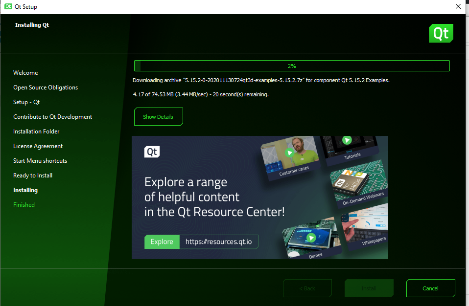
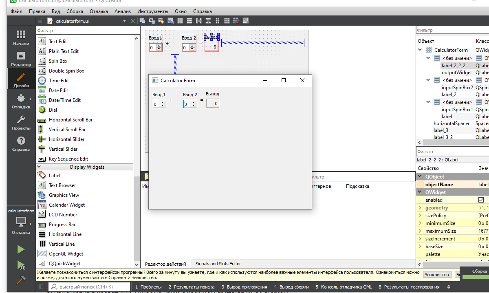

<p align="center">МИНИСТЕРСТВО НАУКИ  И ВЫСШЕГО ОБРАЗОВАНИЯ РОССИЙСКОЙ ФЕДЕРАЦИИ<br>
Федеральное государственное автономное образовательное учреждение высшего образования<br>
"КРЫМСКИЙ ФЕДЕРАЛЬНЫЙ УНИВЕРСИТЕТ им. В. И. ВЕРНАДСКОГО"<br>
ФИЗИКО-ТЕХНИЧЕСКИЙ ИНСТИТУТ<br>
Кафедра компьютерной инженерии и моделирования</p>
<br>
<h3 align="center">Отчёт по лабораторной работе № 1<br> по дисциплине "Программирование"</h3>
<br><br>
<p>студента 1 курса группы ИВТ-б-о-202(2)<br>
Ковальчук Никита Сергеевич<br>
направления подготовки 09.03.01 "Информатика и вычислительная техника"</p>
<br><br>
<table>
<tr><td>Научный руководитель<br> старший преподаватель кафедры<br> компьютерной инженерии и моделирования</td>
<td>(оценка)</td>
<td>Чабанов В.В.</td>
</tr>
</table>
<br><br>
<p align="center">Симферополь, 2020</p>
<hr>

###Тема:Знакомство с фреймворком Qt

### Цель:

1. Установить фреймворк Qt;
2.Изучить основные возможности создания и отладки программ в IDE Qt Creator.

## Постановка задачи
Настроить рабочее окружение, для разработки программного обеспечения при помощи Qt и IDE Qt Creator, а также изучить базовые возможности данного фреймворка.

## Выполнение работы
  Выполняя работу нам потребуется скачать и установить  Qt Creator.(Рис.1) 


<p align="center">  </p>
<p align="center"> Рисунок 1 - установка программы </p> </br>

Далее изменил в главной форме проэкта текст на "Input 1", "Input 2", "Output" на "Ввод 1", "Ввод 2" и "Вывод".(Рис.2)

<p align="center">  </p>
<p align="center"> Рисунок 2 - изменение текста </p> </br>

###Вопросы:

1.Как изменить цветовую схему (оформление) среды?В разделе инструменты-параметры-среда-цвет.
2.Как закомментировать/раскомментировать блок кода средствами Qt Creator? Имеется ввиду комбинация клавиш или пункт меню.Cntrl+/ или выделить текст нажать правую кнопку мышы и выьрать пункт закоментировать
3.Как открыть в проводнике Windows папку с проектом средствами Qt Creator?Указать путь куда сохраняли.
4.Какое расширение файла-проекта используется Qt Creator? Может быть несколько ответов.cpp,h
5.Как запустить код без отладки?В разделе отладка изменить пунтк отладка на выпуск.
6.Кaк установить/убрать точку останова (breakpoint)?Нажатием левой кнопки мыши на место слева рядом с номером необходимой строки.


Далее создаем клиентское приложение без Qt и в файл main.cpp записываем код и созлаем точки остановки на 6,7,8 строках.(Рис.3)


```
<p align="center">  </p>
<p align="center"> Рисинок 3 - код программы </p> </br>


**Вывод:**  В данной лабораторной работе я научился работе в новом приложении Qt.Создал в нем первый проэкт,узнал как изменять цвет среды,как хапускать код в режиме отладки,как закоментироввать код средством Qt.