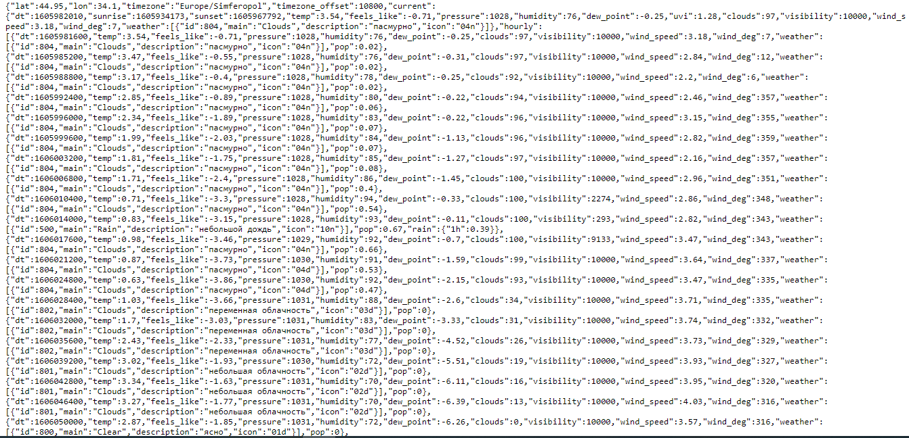
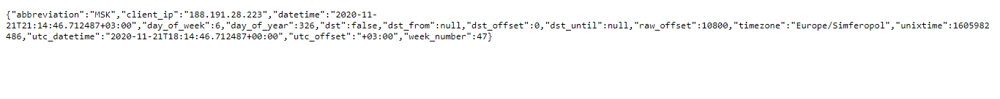
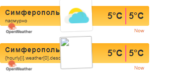
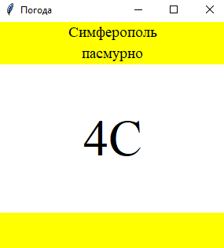

<p align="center">МИНИСТЕРСТВО НАУКИ  И ВЫСШЕГО ОБРАЗОВАНИЯ РОССИЙСКОЙ ФЕДЕРАЦИИ<br>
Федеральное государственное автономное образовательное учреждение высшего образования<br>
"КРЫМСКИЙ ФЕДЕРАЛЬНЫЙ УНИВЕРСИТЕТ им. В. И. ВЕРНАДСКОГО"<br>
ФИЗИКО-ТЕХНИЧЕСКИЙ ИНСТИТУТ<br>
Кафедра компьютерной инженерии и моделирования</p>
<br>
<h3 align="center">Отчёт по лабораторной работе № 1<br> по дисциплине "Программирование"</h3>
<br><br>
<p>студента 1 курса группы ИВТ-б-о-202(2)<br>
Ковальчук Никита Сергеевич<br>
направления подготовки 09.03.01 "Информатика и вычислительная техника"</p>
<br><br>
<table>
<tr><td>Научный руководитель<br> старший преподаватель кафедры<br> компьютерной инженерии и моделирования</td>
<td>(оценка)</td>
<td>Чабанов В.В.</td>
</tr>
</table>
<br><br>
<p align="center">Симферополь, 2020</p>
<hr>

### Цель:

1. Закрепить навыки разработки многофайловыx приложений;
2. Изучить способы работы с API web-сервиса;
3. Изучить процесс сериализации/десериализации данных в/из json;
4. Получить базовое представление о сетевом взаимодействии приложений;

## Постановка задачи
Разработать сервис предоставляющий данные о погоде в городе Симферополе на момент запроса. В качестве источника данных о погоде используйте: [http://openweathermap.org/](http://openweathermap.org/). В состав сервиса входит: серверное приложение на языке С++ и клиентское приложение на языке Python.

Серверное приложение (далее Сервер) предназначенное для обслуживания клиентских приложений и минимизации количества запросов к сервису _openweathermap.org_. Сервер должен обеспечивать возможность получения данных в формате JSON и виде _html_ виджета (для вставки виджета на страницу будет использоваться _[iframe](https://habr.com/ru/post/488516/)_).

Клиентское приложение должно иметь графический интерфейс отображающий сведения о погоде и возможность обновления данных по требованию пользователя.

## Выполнение работы
  Выполняя работу нам потребуется создать запросы к сайтам погоды openweathermap.org и времени worldtimeapi.org. Для этого переходим на эти сайты, переходим в нужные разделы и получаем свои ссылки для получения доступа к данным о погоде и времени.

>http://api.openweathermap.org//data/2.5/onecall?lat=44.952116&lon=34.102411&lang=ru&units=metric&appid=0083423f4d6d9885477d9ae0b151ab8f

При вводе данной ссылки в поисковике получаем json ответ с информацией о погоде с сайта openwether.org(см Рис. 1) 

<p align="center">  </p>
<p align="center"> Рисунок 1 - JSON ответ на обращение к openweathermap.org </p> </br>

Для получения времени составил запрос времени в Симферополе:

>http://worldtimeapi.org/api/timezone/Europe/Simferopol

При вводе данной ссылки в поисковой строке получаем json ответ с нужной нам информацией о времени в Симферополе(Рис. 2)

<p align="center">  </p>
<p align="center"> Рисунок 2 - JSON ответ на обращение к worldtimeapi.org </p> </br>

Далее приступил к написания сервера на языке С++, который при запуске получает данные о погоде и сохраняет их в кэш, далее слушает запросы на localhost:3000 и localhost:3000/raw.
При запросе "/" сервер запрашивает у сайта *openwether.org* данные о погоде на данное время, берет шаблон html виджета из папки с сервером, делает запрос на *worldtimeapi.org* сравнивает время с сайта с временем в кеше, если время устарело на час, то записывает текущее время в кеш. На данный запрос получаем ответ в виде виджета (Рис. 3).
При запросе "/raw" сервер берет те же данные что и для виджета.
Код C++ сервера:
```C++
#include <cpp_httplib/httplib.h>
#include <nlohmann/json.hpp>
#include <iostream>
#include <string>
#include <iomanip>
#include <fstream>
using namespace httplib;
using json = nlohmann::json;

json new_json;
json json_cache;
json _json_time;
int timen = 0;
int cache = 0;
int temp = 0;
int new_q = 0;

void response(const Request& req, Response& rez) {
    
    std::string str;
    std::ifstream html("HTMLWid.html");
    
    Client Cli("http://worldtimeapi.org");
    auto rezult = Cli.Get("/api/timezone/Europe/Simferopol");
    if (rezult) {      
      if (rezult->status == 200) {    
        _json_time = json::parse(rezult->body);      
        timen = _json_time["unixtime"].get<int>();         
      }                                        
      else {        
        std::cout << "Status code: " << rezult->status << std::endl;
      }
    }
    else {
      auto Error = rezult.error(); 
      std::cout << "Error code: " << Error << std::endl;
    }
    
    
    Client cli("http://api.openweathermap.org"); 
    auto rezult2 = cli.Get("/data/2.5/onecall?lat=44.952116&lon=34.102411&lang=ru&units=metric&appid=0083423f4d6d9885477d9ae0b151ab8f");
    if (rezult2) {
      if (rezult2->status == 200) {
        json_cache = json::parse(rezult2->body);
        cache = json_cache["hourly"][json_cache["hourly"].size() - 1]["dt"].get<int>();
      
        for (int i = json_cache["hourly"].size(); i > 0; --i) {  
          for (int q = 0; q < json_cache["hourly"].size(); q++) {
            if (cache > timen and json_cache["hourly"][q]["dt"] <= cache){
              temp = json_cache["hourly"][q]["dt"];      
              cache = temp;
              new_q = q;
            }
          }

        }

      }
      else {
        std::cout << "Status code: " << rezult2->status << std::endl;
      }
    }
    else {
      auto Error = rezult2.error();
      std::cout << "Error code: " << Error << std::endl;
    }

    new_json["description"] = json_cache["hourly"][new_q]["weather"][0]["description"];
    new_json["temp"] = std::to_string(json_cache["hourly"][new_q]["temp"].get<int>());
    std::getline(html, str, '\0');
    
    while (str.find("{hourly[i].temp}") != std::string::npos)
      
      str.replace(str.find("{hourly[i].temp}"), 16,
        std::to_string(json_cache["hourly"][new_q]["temp"].get<int>()));
    str.replace(str.find("{hourly[i].weather[0].description}"), 34, 
      json_cache["hourly"][new_q]["weather"][0]["description"]);
    str.replace(str.find("{hourly[i].weather[0].icon}"), 27, 
      json_cache["hourly"][new_q]["weather"][0]["icon"]);
    
    rez.set_content(str, "text/html");
    }

void response_raw(const Request& req, Response& rez) {
  Client("http://localhost:3000").Get("/");
  rez.set_content(new_json.dump(4), "text/json"); 
  }
  
int main() {
  Server NKoval;
  NKoval.Get("/raw", response_raw); 
  NKoval.Get("/", response);  
  std::cout << "OK\n"; 
  NKoval.listen("localhost", 3000); 
}


```
<p align="center">  </p>
<p align="center"> Рисинок 3 - HTML виджет </p> </br>


 Исходный код клиентского приложения:
```Python
from tkinter import *
from tkinter.font import BOLD
import requests
import json

def reload_data(event=None):
  try:
    response = requests.get('http://localhost:3000/raw').content.decode("utf8")
    cache = json.loads(response)  

    desc.config(text=str(cache["description"]))
    temp.config(text=str(cache["temp"]) + "C")  
  except requests.exceptions.ConnectionError:
    pass

root = Tk()  
root.title("Погода") 
root.pack_propagate()
root.bind("<Button-1>", reload_data)

top = Frame(root, bg="yellow")
top.pack(side=TOP, fill=X)     
middle = Frame(root, bg="white")
middle.pack(expand=True, fill=BOTH)
bottom = Frame(root, bg="yellow", width=200, height=50)
bottom.pack(side=BOTTOM, fill=X)


a = Label(top, font=("Times New Roman", 14), text="Симферополь", bg="yellow")
desc = Label(top, font=("Times New Roman", 14), bg="yellow")
temp = Label(middle, font=("Times New Roman", 48), bg="white")

a.pack(pady=0)
desc.pack(pady=0)
temp.pack(expand=True)

root.mainloop()  
```
<p align="center">  </p>
<p align="center"> Рисунок 4 - Интерфейс клиенского приложения </p> </br>


**Вывод:**  В данной лабораторной работе яСоздал сервер на языке С++, обращающегося к openweathermap.com и возвращающий виджет или описание и температуру в формате json - Приложение с графическим интерфейсом, написанное на языке Python с использованием библиотеки Tkinter, получающее и обрабатывающее данные из сервера.